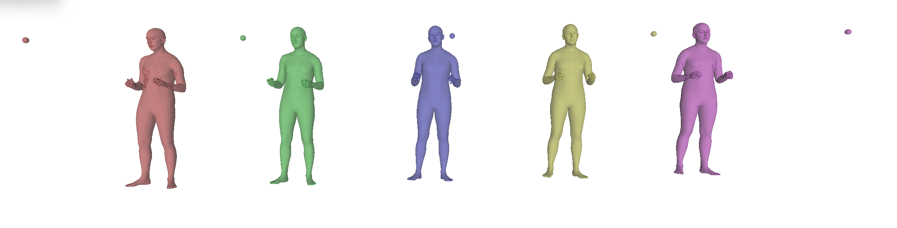

# HR-VQVAE for 3D Human Pose Representation and Generation

A hierarchical residual vector quantized variational autoencoder (HR-VQVAE) adapted for learning compact, discrete representations of 3D human body poses. The model uses multi-level residual quantization with body-part-aware progressive training and differentiable SMPL-X supervision to achieve high-fidelity pose reconstruction and generation.

This work extends the [HR-VQVAE](https://arxiv.org/abs/2208.04554) framework (Adiban et al., BMVC 2022) — originally designed for image reconstruction — to the domain of 3D human pose sequences represented as SMPL-X axis-angle parameters.

## Hierarchical Reconstruction

The figure below shows how reconstruction quality improves as quantization levels are accumulated. From left to right: **Ground Truth**, **Level 1** (coarse, 8 codes), **Level 2** (+ medium, 64 codes), **Level 3** (+ fine, 512 codes), and **Final Output**. Each successive level captures finer geometric detail through residual quantization.

<p align="center">
  
</p>

## Method

### Multi-Level Residual Quantization

The encoder maps a 165-dimensional SMPL-X pose vector into a shared latent space. Instead of quantizing this representation with a single codebook, the model applies a cascade of three quantization levels. Each level operates on the **residual** left by the previous level:

| Level | Codebook Size | Learned Specialization |
|-------|--------------|----------------------|
| 1     | 8            | Facial pose (jaw, eyes) |
| 2     | 64           | Body pose (torso, limbs) |
| 3     | 512          | Hand articulation (fingers) |

The final representation is the sum of quantized vectors across all three levels, decoded by a shared decoder.

### Progressive Training with Stop Gradients

Each quantization level receives a **local loss** with stop-gradient isolation, supervising only the body part it specializes in. A **global loss** backpropagates through all levels jointly. This prevents lower levels from collapsing and encourages each level to specialize:

```
Level 1 loss (stop-grad): axis-angle(face) + mesh(face) + joint(face)
Level 2 loss (stop-grad): axis-angle(body) + mesh(body) + joint(body)
Level 3 loss (stop-grad): axis-angle(hands) + mesh(hands) + joint(hands)
Global loss (full backprop): axis-angle(all) + mesh(all) + joint(all) + commitment
```

### Differentiable SMPL-X Supervision

The model integrates a differentiable [SMPL-X](https://smpl-x.is.tue.mpg.de/) body model layer. During training, reconstructed axis-angle parameters are passed through SMPL-X to produce 3D mesh vertices and joint positions, enabling geometry-level supervision without requiring paired 3D ground truth beyond the parametric model itself.

### Autoregressive Prior (PixelSNAIL)

After training the VQ-VAE, three [PixelSNAIL](https://arxiv.org/abs/1712.09763) models are trained on the extracted discrete codes to learn the prior distribution:

- **Level 1**: p(z_1) — unconditional
- **Level 2**: p(z_2 | z_1) — conditioned on coarse codes
- **Level 3**: p(z_3 | z_2) — conditioned on medium codes

Sampling from these priors and decoding produces novel, unconditional pose generation.

## Architecture

```
Input: (batch, seq_len, 165)  [SMPL-X axis-angle]
         │
    ┌────▼────┐
    │ Encoder  │  1D Conv + Residual Blocks
    └────┬────┘
         │
    ┌────▼────────────────────────────────────┐
    │  Hierarchical Residual Quantization     │
    │                                         │
    │  residual ──► Quantize(8)  ──► q1       │
    │  residual ──► Quantize(64) ──► q2       │
    │  residual ──► Quantize(512)──► q3       │
    │                                         │
    │  output = q1 + q2 + q3                  │
    └────┬────────────────────────────────────┘
         │
    ┌────▼────┐
    │ Decoder  │  1D Conv + Residual Blocks
    └────┬────┘
         │
    ┌────▼─────────┐
    │ SMPL-X Layer  │  Differentiable mesh/joint computation
    └──────────────┘
         │
Output: (batch, seq_len, 165)  [Reconstructed pose]
      + 3D vertices, joints   [For geometric loss]
```

## Project Structure

```
├── m_vqvae_pose.py               # VQ-VAE model (single-level and multi-level)
├── m_pixelsnail.py               # PixelSNAIL autoregressive prior
├── m_smplx_layer.py              # Differentiable SMPL-X integration
├── m_beat_dataset.py             # BEAT2 dataset loader
├── m_train_vqvae.py              # Standard VQ-VAE training loop
├── m_train_vqvae_progressive.py  # Progressive training with stop gradients
├── m_train_pixelsnail.py         # PixelSNAIL prior training
├── m_trainer.py                  # Training orchestrator
├── m_conf_parser.py              # Configuration parser
├── m_util.py                     # Model creation and checkpoint utilities
├── m_sample.py                   # Reconstruction sampling and visualization
├── extract_all_codes.py          # Discrete code extraction from trained VQ-VAE
├── sample_with_prior.py          # Pose generation via PixelSNAIL sampling
├── scheduler.py                  # Cyclic learning rate scheduler
└── checkpoint/                   # Saved models and configurations
```

## Dataset

The model is trained on the [BEAT2](https://pantomatrix.github.io/BEAT/) dataset, which provides motion capture sequences with SMPL-X parametrization. Pose sequences are extracted as sliding windows (120 frames, stride 30) of 165-dimensional axis-angle vectors covering the full body, face, and hands.

## Configuration

Training is configured via INI files (see `checkpoint/beat2_poses/0/vqvae/conf.ini`):

```ini
[Model]
in_channel = 165       # SMPL-X pose dimension
channel = 128          # Hidden channel size
n_res_block = 2        # Residual blocks per encoder/decoder
embed_dim = 32         # Quantization embedding dimension
n_level = 3            # Number of hierarchical levels
n_embed_layer1 = 8     # Codebook size: level 1
n_embed_layer2 = 64    # Codebook size: level 2
n_embed_layer3 = 512   # Codebook size: level 3
decay = 0.9            # EMA decay for codebook updates
use_smplx = True       # Enable SMPL-X geometric supervision

[Train]
batch = 32
epoch = 400
lr = 3e-3
```

## Pipeline

```bash
# Stage 1: Train multi-level VQ-VAE with progressive losses
python m_trainer.py --config checkpoint/beat2_poses/0/vqvae/conf.ini

# Stage 2: Extract discrete codes from trained VQ-VAE
python extract_all_codes.py

# Stage 3: Train PixelSNAIL priors on extracted codes
python m_train_pixelsnail.py

# Stage 4: Generate novel poses by sampling from priors
python sample_with_prior.py
```

## Requirements

- Python 3.8+
- PyTorch
- [SMPL-X](https://smpl-x.is.tue.mpg.de/) body model
- NumPy, SciPy, tqdm
- TensorBoard
- pyrender, trimesh (for visualization)

## References

```bibtex
@inproceedings{adiban2022hierarchical,
  title={Hierarchical Residual Learning Based Vector Quantized Variational Autoencoder
         for Image Reconstruction and Generation},
  author={Adiban, Mohammad and Stefanov, Kalin and Siniscalchi, Sabato Marco and Salvi, Giampiero},
  booktitle={British Machine Vision Conference (BMVC)},
  year={2022}
}
```

- [SMPL-X: Expressive Body Capture](https://smpl-x.is.tue.mpg.de/) — Pavlakos et al., CVPR 2019
- [PixelSNAIL: An Improved Autoregressive Generative Model](https://arxiv.org/abs/1712.09763) — Chen et al., ICML 2018
- [BEAT: A Large-Scale Semantic and Emotional Multi-Modal Dataset](https://pantomatrix.github.io/BEAT/) — Liu et al., ECCV 2022
